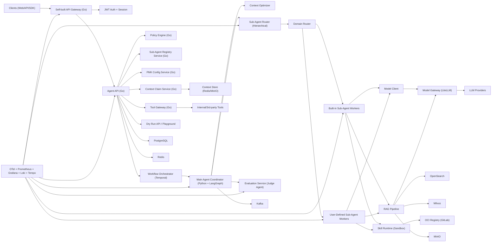
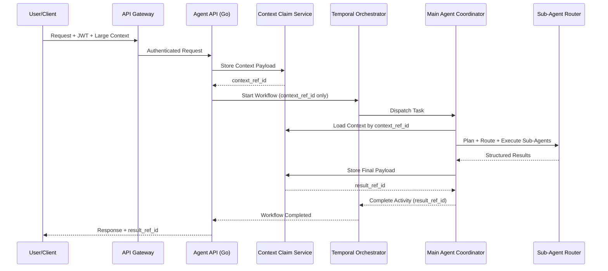
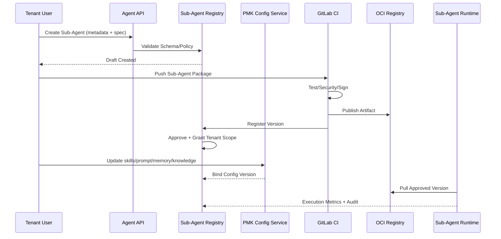

# 企业级通用 Agent 平台架构设计

- 文档版本：v1.3
- 状态：Locked（与技术栈一致）
- 更新时间：2026-02-09
- 适用阶段：MVP -> Beta -> GA

## 1. 目标与边界

### 1.1 架构目标

- 提供统一 Agent 平台，支撑 API/SDK/Web 三种接入。
- 采用 Main Agent + Multi Sub-Agent 架构，支持复杂任务拆解与并行执行。
- 支持用户自定义子 Agent 的全生命周期管理（注册、审批、发布、授权、回滚）。
- 支持用户自维护 `skills/prompt/memory/knowledge` 并纳入治理与审计。
- 采用 Go + Python 双栈，兼顾平台治理稳定性与 AI 执行效率。
- 满足企业级要求：安全合规、可靠性、可观测、可运维。

### 1.2 非目标

- 不承载具体业务系统编排细节（由业务应用自行实现）。
- 不维护多套并行后端体系（只保留锁定技术路线）。

## 2. 设计原则

- 分层解耦：接入层、控制面、执行面、数据面、治理面独立演进。
- 主子解耦：Main Agent 负责编排决策，Sub-Agent 专注单一能力执行。
- 模型解耦：所有模型调用统一走 Model Gateway，执行面不直连模型厂商。
- 宏微分层：Temporal 负责宏观工作流，LangGraph 负责微观推理循环。
- 大载荷解耦：使用 Claim Check Pattern，避免大 Context 穿透 gRPC/Temporal。
- 默认安全：JWT 鉴权、最小权限、全链路审计为默认配置。
- 韧性优先：限流、超时、重试、熔断、隔离是平台内建能力。
- 可观测优先：请求、工作流、Main Agent、Sub-Agent、Skill 全链路可追踪。
- 多租户隔离：身份、数据、配额、审计均按租户边界隔离。

## 3. 逻辑架构

## 4. 组件职责

### 4.1 接入层（Go）

- `Self-built API Gateway`：统一入口、路由、限流、租户识别、追踪注入。
- `JWT Auth + Session`：Access Token 校验、Refresh Token 轮换、会话失效控制。

### 4.2 控制面（Go）

- `Agent API`：任务创建、会话管理、幂等控制、结果回传。
- `Policy Engine`：策略校验、权限判定、风险动作拦截。
- `Workflow Orchestrator`：通过 Temporal 管理状态机、超时、补偿、重试。
- `Tool Gateway`：工具注册、权限治理、工具调用审计与隔离。
- `Sub-Agent Registry Service`：子 Agent 元数据、版本、发布通道、租户授权、灰度策略。
- `PMK Config Service`：租户级 prompt、memory、knowledge 配置管理与审计。
- `Context Claim Service`：管理大载荷上下文 Claim Check（`context_ref_id`）。
- `Dry Run API`：为开发者提供仿真调试入口与 Mock Context。

### 4.3 执行面（Python）

- `Main Agent Coordinator`：任务拆解、子 Agent 选择、执行顺序编排、结果聚合。
- `Context Optimizer`：上下文预算控制与裁剪（FIFO/Summary/Importance）。
- `Sub-Agent Router (Hierarchical)`：先做领域路由，再在领域内选择子 Agent。
- `Built-in Sub-Agent Workers`：平台内置能力（检索、代码、分析、工具执行）。
- `User-Defined Sub-Agent Workers`：用户上传并发布的子 Agent 执行体。
- `Skill Runtime`：按策略加载 Skill，隔离执行并标准化输出。
- `Prompt Loader`：加载租户版本化 prompt 模板。
- `Memory Manager`：按租户 memory 策略读写短期/长期记忆。
- `Knowledge Binder`：按租户配置绑定知识空间与召回策略。
- `Model Client`：统一调用 `model-gateway`，输出结构化结果与成本元数据。
- `Evaluation Service (Judge Agent)`：在线质量评估与反馈回流。

### 4.4 模型服务（独立）

- `Model Gateway (LiteLLM)`：统一模型协议、路由、限流、成本计量、模型级 fallback。
- 约束：Main Agent、Sub-Agent、RAG embedding 统一经 `model-gateway`，禁止直连外部模型。

### 4.5 数据面

- `PostgreSQL`：任务元数据、策略配置、子 Agent 元数据、审计索引。
- `Redis`：会话缓存、热点缓存、分布式锁、短期记忆。
- `Context Store (Redis/MinIO)`：大上下文与大结果载荷存储。
- `Kafka`：异步事件总线与跨服务解耦。
- `OpenSearch + Milvus`：混合检索与语义召回。
- `MinIO`：文档、索引工件、审计归档存储。
- `OCI Registry`：用户自定义子 Agent 包分发。

## 5. 关键时序

### 5.1 主 Agent 调度多子 Agent（含 Claim Check）

### 5.2 用户自定义子 Agent 生命周期

### 5.3 Temporal 与 LangGraph 职责边界

- Temporal（Macro-Orchestration）：请求生命周期、总超时、挂起/唤醒、补偿、异步回调、计费扣减。
- LangGraph（Micro-Reasoning）：Main Agent 的推理回路与子 Agent 选择。
- 边界规则：一次 `Thinking -> Tool/Sub-Agent Calls -> Aggregation` 封装为一个 Temporal Activity。
- 禁止规则：不使用 LangGraph Checkpointer 取代 Temporal 持久化。

## 6. 部署与运行时隔离

### 6.1 部署形态

- 运行平台：Kubernetes（建议多可用区）。
- 配置管理：Kustomize（按 `dev/staging/prod` 管理 overlays）。
- 发布链路：GitLab CI 构建与扫描，Argo CD 按 GitOps 发布。

### 6.2 沙箱与网络隔离

- 沙箱默认：`gVisor RuntimeClass`（用户自定义子 Agent 与 Skill Runtime 必选）。
- 可选增强：Kata Containers / Firecracker（高风险租户）。
- 网络策略：K8s `NetworkPolicy` 默认 `Deny All`。
- 出网控制：仅允许通过 Egress Gateway 访问白名单目标。
- 资源配额：按租户和命名空间配置 `ResourceQuota + LimitRange`。

### 6.3 容灾目标

- RTO：<= 30 分钟
- RPO：<= 5 分钟
- 关键存储启用跨可用区复制与周期备份。

## 7. 上下文管理与成本控制

- 上下文预算：租户级 `max_context_window` 与 `budget_limit`。
- 自动裁剪：FIFO、Summary、Importance 三策略。
- 执行前优化：Main Agent 每轮执行先经过 Context Optimizer。
- 目标：避免 token 线性增长与 “Lost in the Middle” 影响。

## 8. 安全、可靠性与降级

### 8.1 安全基线

- 认证：JWT Token（RS256）+ Refresh Token。
- 授权：RBAC + 资源级策略（Main Agent、Sub-Agent、Tool、Skill、Knowledge）。
- 用户维护配置：skills/prompt/memory/knowledge 仅在租户授权范围内可变更并全量审计。
- 审计：策略命中、子 Agent 执行、工具调用、权限变更全量留痕。

### 8.2 降级与兜底

- 模型级 Fallback：主模型超时/限流时自动切换备用模型。
- 模型级 Fallback 执行点：`model-gateway`（LiteLLM）内部完成。
- 规则级 Fallback：Main Agent 连续 N 次结构化解析失败回退 Rule Engine。
- 人工级 Fallback：高风险或多次失败任务转人工处理队列。
- 失败重放：异步失败进入 DLQ，支持审计后重放。

## 9. 可观测、评估与反馈闭环

### 9.1 系统级可观测

- 指标：可用性、错误率、P95/P99、Main Agent 成功率、Sub-Agent 成功率、成本。
- 追踪：OTel Trace 贯穿网关、Go 控制面、Temporal、Main Agent、Sub-Agent。
- 日志：统一 `trace_id`、`tenant_id`、`task_id`、`main_agent_id`、`sub_agent_id`、`prompt_version`、`memory_profile_id`、`knowledge_space_ids`。

### 9.2 效果级可观测（Evals）

- 在线评估：Judge Agent 对结果做相关性、准确性、无害性评分。
- 用户反馈：点赞/点踩与纠正答案回流。
- 评估指标：`answer_quality_score`、`ground_truth_match_rate`、`hallucination_rate`。
- 数据回流：反馈数据进入评估集，驱动 prompt/策略优化。

## 10. 开发体验（Debug / Dry Run）

- Dry Run API：不入生产队列的仿真执行模式。
- Playground：支持构造 Mock Context 单测 Sub-Agent。
- Remote Debug：开发环境联调 Main Agent 与目标 Sub-Agent。
- 变更安全：Dry Run 结果不影响生产状态与计费数据。

## 11. 与后续文档对齐

- 技术选型细节见：`tech-stack.md`
- 实施里程碑见：`implementation-plan.md`
- 执行状态与风险追踪见：`progress.md`
- 子 Agent 规范见：`service-designs/sub-agent-management.md`
